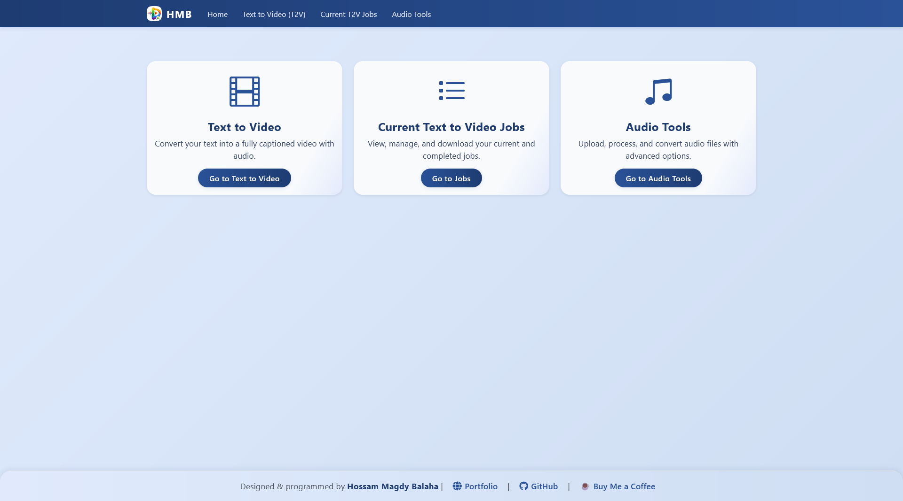

# 🎬 Audio-Captioned Automated Transcription & Video Generation Suite

[](https://github.com/HossamBalaha/Audio-Captioned-Automated-Transcription-Video-Generation-Suite/actions)
[](https://github.com/HossamBalaha)
[](README.md)
[](#)
[](requirements.txt)
[](LICENSE)
[](https://coff.ee/hossambalaha)

A comprehensive, modular suite to automatically generate captioned videos from text or audio using Whisper, Kokoro TTS,
FFmpeg, and a Flask API. Includes 30 advanced audio processing tools for professional-grade media automation.

**Author:** Hossam Magdy Balaha  
**GitHub:** [https://github.com/HossamBalaha](https://github.com/HossamBalaha)  
**CV:** [hossambalaha.github.io](https://hossambalaha.github.io/)  
**Support:** [☕ Buy Me a Coffee](https://coff.ee/hossambalaha)  
**Status:** Active Development

---

## 📑 Table of Contents

- [🎯 Overview](#-overview)
- [✨ Key Features](#-key-features)
- [🚀 Quick Start (5 Minutes)](#-quick-start-5-minutes)
- [🎨 Web Interface](#-web-interface)
- [🤖 N8N Integration & Applicability](#-n8n-integration--applicability)
- [🎵 Audio Tools: Comprehensive Suite](#-audio-tools-comprehensive-suite)
- [📁 Project Structure](#-project-structure)
- [⚙️ Prerequisites](#-prerequisites)
- [🛠️ Installation & Setup](#-installation--setup)
- [🎯 Usage Instructions](#-usage-instructions)
- [🔌 API Reference](#-api-reference)
- [📖 Comprehensive API Examples & Demonstrations](#-comprehensive-api-examples--demonstrations)
- [🧪 Testing](#-testing)
- [📄 License & Attribution](#-license--attribution)
- [💬 Support & Community](#-support--community)
- [🙏 Acknowledgments](#-acknowledgments)
- [❓ FAQ](#-faq)
- [🎯 Success Stories](#-success-stories)

---

## 🎯 Overview

This is a complete end-to-end solution for automated, AI-driven video content creation. It transforms text or audio
input into professional-quality, caption-synchronized videos suitable for social media, education, marketing, and
automation platforms like N8N.

**Core Workflow:**

1. Submit text or audio via API, web UI, or automated workflow
2. System transcribes audio or generates voiceover from text
3. Extract timing information for precise caption synchronization
4. Select background video assets and generate final captioned video
5. Process with advanced audio tools for professional quality
6. Download or integrate into automated publishing pipelines

**Ideal For:**

- Content creators generating shorts/reels
- Educational content automation
- Marketing teams producing videos at scale
- N8N automation workflows
- Custom video pipeline development

---

## ✨ Key Features

### Video Generation

- **End-to-End Automation:** Transform text/audio into synchronized, captioned videos with natural-sounding voiceovers
- **Speech & Transcription:** Whisper for accurate speech-to-text with word-level timing and multilingual support
- **Text-to-Speech:** Kokoro TTS with multiple languages, voices, and customizable speech rates
- **Advanced Video Processing:** FFmpeg for trimming, merging, format conversion, and caption overlay

### Audio Processing Suite (30 Tools)

- **Analysis:** Duration, size, silence detection, audio analysis
- **Enhancement:** Noise reduction, silence removal, bass/treble boost, compression, stereo adjustment
- **Transformation:** Channel conversion, pitch shifting, looping, echo effects, crossfading
- **Generation:** Waveform visualization, spectrum analysis, speech-to-text transcription
- **Advanced:** Multi-track mixing, audio merging, format conversion, trim/split operations

### Platform Features

- **RESTful API:** Robust Flask API with comprehensive endpoint coverage
- **Web Interface:** Modern, responsive UI for job submission and tool access
- **Flexible I/O:** MP3, WAV, OGG audio; 4K, Full HD video quality; horizontal/vertical formats
- **Batch Processing:** Submit multiple jobs for scalable automation
- **Extensible Design:** Modular architecture for easy integration and customization
- **N8N Ready:** Seamless integration with N8N workflow automation

---

## 🚀 Quick Start (5 Minutes)

### 1. Install & Run

```cmd
:: Clone and setup
git clone https://github.com/HossamBalaha/Audio-Captioned-Automated-Transcription-Video-Generation-Suite.git
cd Audio-Captioned-Automated-Transcription-Video-Generation-Suite

:: (Optional) Create and activate a virtualenv
python -m venv .venv
call .venv\Scripts\activate

:: Install dependencies
pip install -r requirements.txt

:: Run server
python Server.py
```

### 2. Access the App

Open `http://localhost:5000` in your browser

### 3. Generate Your First Video

1. Go to **Text to Video** tab
2. Enter text: *"Hello world, this is my first generated video"*
3. Select language: **English**
4. Select voice: **af_nova**
5. Click **Create Job**
6. Monitor in **Jobs** tab
7. Download when complete ✅

---

## 🎨 Web Interface

Modern, user-friendly interface built with Flask and Bootstrap for seamless interaction.

**Key Technologies:**

- Flask (Python web framework)
- Bootstrap 5 (responsive design)
- jQuery & vanilla JavaScript
- HTML5 & CSS3

**Pages & Features:**

### 📑 Index

Overview page with quick access to main features and project introduction.



### 📝 Text to Video

Generate videos from text input with customizable:

- Language and voice selection
- Video type (horizontal/vertical)
- Quality settings (4K, Full HD, etc.)
- Real-time job submission and tracking


### 📊 T2V Jobs Management

Track and manage all video generation jobs:

- Real-time status updates
- Job details and progress
- Download final videos
- Job history


### 🎵 Audio Tools

Access all 30 audio processing tools:

- Interactive tool cards with descriptions
- Modal dialogs with form inputs
- Real-time processing with status indicators
- Automatic download on completion


---

## 🤖 N8N Integration & Applicability

Seamlessly integrate with N8N workflow automation for powerful media production orchestration:

### Automation Capabilities

- **Auto-Trigger:** Start video creation from emails, webhooks, cloud uploads, or database records
- **Batch Processing:** Schedule or batch-submit multiple jobs for large-scale production
- **Multi-Step Workflows:** Chain transcription → TTS → video assembly → publishing
- **API Integration:** HTTP Request nodes interact with all REST endpoints
- **Conditional Logic:** Route jobs based on status, retry failed tasks, send notifications
- **Content Enrichment:** Combine with N8N nodes for scripts, translation, branding
- **Scalable Automation:** Connect with cloud storage, databases, and third-party services

### Example N8N Workflow

```
Webhook Trigger
    ↓
Submit Job → /api/v1/jobs
    ↓
Poll Status → /api/v1/jobs/<jobId>
    ↓
Download → /api/v1/jobs/<jobId>/result
    ↓
Publish → YouTube/TikTok/Drive
    ↓
Notify → Slack/Email
```

### Benefits

- No-code automation for non-developers
- Visual workflow builder
- Hundreds of service integrations
- Scalable, repeatable media production

See [N8N Documentation](https://n8n.io/docs/) for integration details.

---

## 🎵 Audio Tools: Comprehensive Suite

### 30 Total Audio Tools

- Get Audio Duration
- Get Audio Size
- Check Silence
- Analyze Audio
- Reduce Noise
- Remove Silence
- Enhance Audio (bass/treble)
- Compress Audio (dynamic range)
- Adjust Stereo Width
- Convert Channels (Stereo ↔ Mono)
- Shift Pitch
- Loop Audio
- Add Echo
- Crossfade Audio
- Generate Waveform (PNG)
- Generate Spectrum (Video)
- Transcribe Audio (TXT/JSON/SRT)
- Mix Audio (multi-track)
- Normalize Audio
- Generate Silent Audio
- Convert Audio (format)
- Change Volume
- Change Speed
- Reverse Audio
- Extract Audio (from video)
- Concatenate Audios
- Split Audio (segments)
- Fade In/Out
- Remove Vocals
- Equalize/Filter

### API Endpoints (30 Total)

#### Audio Analysis

```
POST /api/v1/audio-duration          - Get duration
POST /api/v1/audio-size              - Get file size
POST /api/v1/check-silence           - Detect silence
POST /api/v1/analyze-audio           - Comprehensive analysis
```

#### Audio Processing

```
POST /api/v1/reduce-noise            - Noise reduction
POST /api/v1/remove-silence          - Remove silent portions
POST /api/v1/enhance-audio           - Bass/treble enhancement
POST /api/v1/compress-audio          - Dynamic compression
POST /api/v1/convert-channels        - Channel conversion
POST /api/v1/loop-audio              - Audio looping
POST /api/v1/shift-pitch             - Pitch shifting
POST /api/v1/add-echo                - Echo effects
POST /api/v1/adjust-stereo           - Stereo width adjustment
POST /api/v1/generate-waveform       - Waveform generation
POST /api/v1/generate-spectrum       - Spectrum visualization
POST /api/v1/crossfade-audio         - Audio crossfading
POST /api/v1/transcribe-audio        - Speech-to-text
POST /api/v1/mix-audio               - Multi-track mixing
```

#### Existing Tools

```
POST /api/v1/normalize-audio         - Audio normalization
POST /api/v1/generate-silent-audio   - Generate silence
POST /api/v1/convert-audio           - Format conversion
POST /api/v1/change-volume           - Volume adjustment
POST /api/v1/change-speed            - Speed adjustment
POST /api/v1/reverse-audio           - Reverse audio
POST /api/v1/extract-audio           - Extract from video
POST /api/v1/concat-audio            - Concatenate files
POST /api/v1/split-audio             - Split into segments
POST /api/v1/fade-audio              - Fade in/out
POST /api/v1/remove-vocals           - Vocal removal
POST /api/v1/equalize-audio          - EQ filtering
```

#### File Management

```
GET /api/v1/download/<filename>      - Download processed files
```

---

## 📁 Project Structure

```
Audio-Captioned-Automated-Transcription-Video-Generation-Suite/
├── README.md                      # This file
├── configs.yaml                   # Main configuration file
├── requirements.txt               # Python dependencies
├── Server.py                      # API server with all endpoints
├── ConfigsSettings.py             # Configuration parser
├── FFMPEGHelper.py                # FFmpeg wrapper (audio/video processing)
├── TextToSpeechHelper.py          # Kokoro TTS integration
├── WhisperTranscribeHelper.py     # Whisper transcription
├── VideoCreatorHelper.py          # Video assembly logic
├── TextHelper.py                  # Text processing utilities
├── routes.py                      # Web UI routes
├── apiRoutes.py                   # API endpoint definitions
│
├── Jobs/                          # Job storage directory
│   ├── <jobId>/
│   │   ├── job.json               # Job metadata
│   │   ├── audio.mp3              # Generated audio
│   │   └── <jobId>_Final.mp4      # Final video output
│
├── Assets/                        # Static assets
│   ├── Videos/
│   │   ├── Horizontal Videos/     # Horizontal format backgrounds
│   │   └── Vertical Videos/       # Vertical format backgrounds
│   ├── Audios/                    # Test audio files
│   └── Fonts/                     # Caption fonts
│
├── templates/                     # HTML templates
│   ├── base.html                  # Base template
│   ├── index.html                 # Homepage
│   ├── text2Video.html            # Video generation page
│   ├── audioTools.html            # Audio tools page
│   └── jobs.html                  # Job management page
│
├── static/                        # Static files
│   ├── css/
│   │   └── styles.css             # Main stylesheet
│   ├── js/
│   │   └── scripts.js             # Interactive scripts
│   └── images/                    # UI images and logos
│
└── tests/                         # Test suites
    ├── TestAudioTools.py          # Audio tools test suite
    └── TestAudioEndpoints.py      # API endpoint tests
```

### Core Configuration (configs.yaml)

```yaml
verbose: true
storePath: "./Jobs"

api:
  version: "v1"
  port: 5000
  maxJobs: 1
  maxTextLength: 2500

tts:
  language: "en-us"
  voice: "af_nova"
  sampleRate: 24000
  speechRate: 1.0

whisper:
  modelName: "turbo"
  language: "en"

video:
  default: "./Assets/Videos"
  type: "Horizontal"
  quality: "4K"
  fps: 30
  maxLengthPerVideo: 5

ffmpeg:
  audioFormat: "mp3"
  applyNormalization: true
  videoCodec: "libx264"
  audioCodec: "libmp3lame"
  pixelFormat: "yuv420p"
  sampleRate: 44100
  channels: 2

audio:
  allowedExtensions: [ ".mp3", ".wav", ".ogg" ]
  default: "./Assets/Audios"
```

---

## ⚙️ Prerequisites

- **Python 3.10+**
- **FFmpeg** with audio/video codec support
- **pip** (Python package manager)
- **Git** (optional, for cloning)
- **4GB+ RAM** (recommended for TTS/Whisper models)
- **10GB+ Disk Space** (for models and job storage)

---

## 🛠️ Installation & Setup

### 1. Clone Repository

```bash
git clone https://github.com/HossamBalaha/Audio-Captioned-Automated-Transcription-Video-Generation-Suite.git
cd Audio-Captioned-Automated-Transcription-Video-Generation-Suite
```

### 2. Verify FFmpeg Installation

```bash
# Windows
ffmpeg -version
ffprobe -version

# Linux/Mac
which ffmpeg
which ffprobe
```

If not installed:

```bash
# Windows (with chocolatey)
choco install ffmpeg

# Ubuntu/Debian
sudo apt-get install ffmpeg

# macOS (with homebrew)
brew install ffmpeg
```

### 3. Install Python Dependencies

```bash
pip install -r requirements.txt
```

**Key Dependencies:**

- Flask - Web framework
- ffmpeg-python - FFmpeg wrapper
- openai-whisper - Speech-to-text
- torch - Deep learning framework
- requests - HTTP library

### 4. Verify Configuration

```bash
# Review default settings
cat configs.yaml

# Optionally edit for your needs
# All settings can be adjusted in ConfigsSettings.py
```

### 5. Prepare Assets

```bash
# Add background videos
# Place video files in: Assets/Videos/Horizontal Videos/ or Vertical Videos/

# Add test audio files (optional)
# Place in: Assets/Audios/

# Add custom fonts (optional)
# Place in: Assets/Fonts/
```

### 6. Run Server

```bash
python Server.py
```

Server will start at: `http://localhost:5000`

---

## 🎯 Usage Instructions

### Via Web Interface

1. **Navigate to UI:**
    - Home: `http://localhost:5000/`
    - Video Generation: `http://localhost:5000/text2Video`
    - Audio Tools: `http://localhost:5000/audioTools`
    - Job Management: `http://localhost:5000/jobs`

2. **Generate Video:**
    - Enter text for conversion (max 6500 characters)
    - Select language, voice, quality, type
    - Submit job
    - Monitor status in real-time
    - Download when complete

3. **Use Audio Tools:**
    - Click desired tool card
    - Upload audio file(s)
    - Configure parameters as needed
    - Process
    - Automatically download result

4. **Manage Jobs:**
    - View all jobs with status
    - See job creation timestamps
    - Download completed videos
    - Track processing progress

---

## 🔌 API Reference

<details>
<summary>API Reference (click to expand)</summary>

This API is versioned under `/api/v1`. All responses are JSON unless a file is returned. Upload endpoints expect
multipart/form-data. Error responses include an `error` field describing the issue.

Base URL: `http://localhost:<port>` where `<port>` matches `configs.yaml` (`api.port`, default 5000).

### Conventions

- Authentication: None by default (add reverse proxy or auth if deploying to production)
- Rate limits: None enforced by the app
- File uploads: Use `multipart/form-data` with the specified form field names
- JSON bodies: Use `Content-Type: application/json`
- Downloads: Returned via `GET /api/v1/download/<filename>` or `GET /api/v1/jobs/<jobId>/result`

### Server & Capabilities

#### GET `/api/v1/status` — Health check

**Purpose:** Verify server is running and responsive.

**Request:**

```bash
curl http://localhost:5000/api/v1/status
```

**Response:** 200 OK

```json
{
  "status": "Server is running"
}
```

**Use Cases:** Health monitoring, load balancer checks, uptime verification

---

#### GET `/api/v1/ready` — Capacity check

**Purpose:** Check if server can accept new video generation jobs.

**Request:**

```bash
curl http://localhost:5000/api/v1/ready
```

**Response (Ready):** 200 OK

```json
{
  "ready": true
}
```

**Response (Busy):** 503 Service Unavailable

```json
{
  "ready": false,
  "jobsInProgress": 3
}
```

**Use Cases:** Pre-flight checks before job submission, batch processing, queue management

---

#### GET `/api/v1/languages` — Available TTS languages

**Purpose:** Get all supported text-to-speech languages.

**Request:**

```bash
curl http://localhost:5000/api/v1/languages
```

**Response:** 200 OK

```json
{
  "languages": [
    "en-us",
    "en-gb",
    "es-es",
    "fr-fr",
    "de-de",
    "ja-jp",
    "zh-cn",
    "pt-br"
  ]
}
```

**Use Cases:** Populate UI dropdowns, validate user input, language selection

---

#### GET `/api/v1/voices?type=list|dict` — Available voices

**Purpose:** Get TTS voices as list or grouped by language.

**Request (List format):**

```bash
curl "http://localhost:5000/api/v1/voices?type=list"
```

**Response:** 200 OK

```json
{
  "voices": [
    "af_nova",
    "af_bella",
    "af_sarah",
    "am_michael",
    "am_adam",
    "bf_emma",
    "bm_george"
  ]
}
```

**Request (Dictionary format):**

```bash
curl "http://localhost:5000/api/v1/voices?type=dict"
```

**Response:** 200 OK

```json
{
  "voices": {
    "en-us": [
      "af_nova",
      "af_bella",
      "af_sarah",
      "am_michael",
      "am_adam"
    ],
    "en-gb": [
      "bf_emma",
      "bm_george"
    ],
    "es-es": [
      "e_diosa",
      "e_dario"
    ],
    "fr-fr": [
      "f_ailette",
      "f_baptiste"
    ]
  }
}
```

**Parameters:**

- `type` (string, optional): "list" or "dict" format (default: "list")

**Use Cases:** Build language-specific voice selectors, voice preview features, content localization

---

#### GET `/api/v1/videoTypes` — Available video aspect types

**Purpose:** Get supported video aspect ratios.

**Request:**

```bash
curl http://localhost:5000/api/v1/videoTypes
```

**Response:** 200 OK

```json
{
  "videoTypes": [
    "Horizontal",
    "Vertical"
  ]
}
```

**Use Cases:** Platform-specific generation (YouTube vs TikTok), UI option display

---

#### GET `/api/v1/videoQualities` — Available video qualities

**Purpose:** Get supported video resolutions.

**Request:**

```bash
curl http://localhost:5000/api/v1/videoQualities
```

**Response:** 200 OK

```json
{
  "videoQualities": [
    "4K",
    "Full HD",
    "HD",
    "480p",
    "360p"
  ]
}
```

**Use Cases:** Quality selector UI, bandwidth-based selection, storage optimization

### Video Generation API

#### POST `/api/v1/jobs` — Create text-to-video job

**Purpose:** Submit text for automated video generation.

**Request (Minimal):**

```bash
curl -X POST http://localhost:5000/api/v1/jobs \
  -H "Content-Type: application/json" \
  -d '{"text":"Hello world!"}'
```

**Request (Full options):**

```bash
curl -X POST http://localhost:5000/api/v1/jobs \
  -H "Content-Type: application/json" \
  -d '{
    "text": "Welcome to our product launch.",
    "language": "en-us",
    "voice": "af_nova",
    "speechRate": 1.0,
    "videoQuality": "4K",
    "videoType": "Horizontal"
  }'
```

**Parameters:**

- `text` (string, required): Text to convert to speech (max 2500 chars)
- `language` (string, optional): TTS language code (default: from config)
- `voice` (string, optional): Voice identifier (default: from config)
- `speechRate` (float, optional): Speed multiplier 0.5-2.0 (default: 1.0)
- `videoQuality` (string, optional): "4K", "Full HD", "HD", etc.
- `videoType` (string, optional): "Horizontal" or "Vertical"

**Success Response:** 202 Accepted

```json
{
  "jobId": "a1b2c3d4e5f6g7h8i9j0k1l2m3n4o5p6"
}
```

**Error Response (Missing text):** 400 Bad Request

```json
{
  "error": "Text is required"
}
```

**Error Response (Text too long):** 400 Bad Request

```json
{
  "error": "Text exceeds maximum length of 2500 characters"
}
```

**Use Cases:** Content creation for YouTube/TikTok, education videos, product demos, voiceovers

---

#### GET `/api/v1/jobs` — List all jobs

**Purpose:** Retrieve all video generation jobs with current status.

**Request:**

```bash
curl http://localhost:5000/api/v1/jobs
```

**Response:** 200 OK

```json
{
  "jobs": [
    {
      "jobId": "a1b2c3d4e5f6g7h8i9j0k1l2m3n4o5p6",
      "status": "completed",
      "text": "Hello world!",
      "language": "en-us",
      "voice": "af_nova",
      "speechRate": 1.0,
      "videoQuality": "4K",
      "videoType": "Horizontal",
      "createdAt": "2025-12-14 10:30:00",
      "isCompleted": true
    },
    {
      "jobId": "b2c3d4e5f6g7h8i9j0k1l2m3n4o5p6q7",
      "status": "processing",
      "text": "Welcome to our channel...",
      "language": "en-us",
      "voice": "am_michael",
      "speechRate": 0.9,
      "videoQuality": "Full HD",
      "videoType": "Vertical",
      "createdAt": "2025-12-14 10:35:00",
      "isCompleted": false
    }
  ]
}
```

**Status values:** queued, processing, completed, failed

**Use Cases:** Monitor job queue, display status dashboard, track history

---

#### GET `/api/v1/jobs/<jobId>` — Get job details

**Purpose:** Get detailed information and status for a specific job.

**Request:**

```bash
curl http://localhost:5000/api/v1/jobs/a1b2c3d4e5f6g7h8i9j0k1l2m3n4o5p6
```

**Response (Completed):** 200 OK

```json
{
  "jobId": "a1b2c3d4e5f6g7h8i9j0k1l2m3n4o5p6",
  "status": "completed",
  "text": "Hello world!",
  "language": "en-us",
  "voice": "af_nova",
  "speechRate": 1.0,
  "videoQuality": "4K",
  "videoType": "Horizontal",
  "createdAt": "2025-12-14 10:30:00"
}
```

**Error Response:** 404 Not Found

```json
{
  "error": "Job not found"
}
```

**Use Cases:** Poll job status, update UI progress, monitor processing

---

#### POST `/api/v1/jobs/triggerRemaining` — Trigger queue processing

**Purpose:** Manually trigger processing of queued jobs.

**Request:**

```bash
curl -X POST http://localhost:5000/api/v1/jobs/triggerRemaining
```

**Response:** 200 OK

```json
{
  "message": "Triggered processing for remaining queued jobs."
}
```

**Use Cases:** Restart processing after server restart, manual queue management

---

#### GET `/api/v1/jobs/<jobId>/result` — Download completed video

**Purpose:** Download the final processed video file.

**Request:**

```bash
curl -O http://localhost:5000/api/v1/jobs/a1b2c3d4e5f6g7h8i9j0k1l2m3n4o5p6/result
```

**Request (Custom filename):**

```bash
curl http://localhost:5000/api/v1/jobs/a1b2c3d4e5f6g7h8i9j0k1l2m3n4o5p6/result \
  --output my-video.mp4
```

**Success Response:** 200 OK

- Content-Type: video/mp4
- Body: Binary video file

**Error Response (Not ready):** 400 Bad Request

```json
{
  "error": "Job not completed yet"
}
```

**Error Response (Not found):** 404 Not Found

```json
{
  "error": "Job not found"
}
```

**Use Cases:** Download completed videos, automated workflows, integration with publishing platforms

---

#### DELETE `/api/v1/jobs/<jobId>` — Delete job

**Purpose:** Remove a specific job and all associated files.

**Request:**

```bash
curl -X DELETE http://localhost:5000/api/v1/jobs/a1b2c3d4e5f6g7h8i9j0k1l2m3n4o5p6
```

**Response:** 200 OK

```json
{
  "message": "Job data deleted successfully"
}
```

**Error Response:** 404 Not Found

```json
{
  "error": "Job not found"
}
```

**Use Cases:** Clean up old jobs, free disk space, manage job history

---

#### DELETE `/api/v1/jobs/all` — Delete all jobs

**Purpose:** Remove all jobs and associated files (use with caution).

**Request:**

```bash
curl -X DELETE http://localhost:5000/api/v1/jobs/all
```

**Response:** 200 OK

```json
{
  "message": "All job data deleted successfully"
}
```

**⚠️ Warning:** Permanently deletes all video generation jobs and files.

**Use Cases:** System reset, development testing, storage cleanup

### File Download

#### GET `/api/v1/download/<filename>` — Download processed file

**Purpose:** Retrieve any file produced by audio/video processing or job results.

**Request:**

```bash
curl -O http://localhost:5000/api/v1/download/your_file.mp3
```

**Response:** 200 OK

- Body: binary file contents
- Headers: `Content-Type` based on file, `Content-Disposition: attachment`

**Error Responses:**

- 404 Not Found

```json
{
  "error": "File not found"
}
```

- 403 Forbidden

```json
{
  "error": "File is not accessible"
}
```

**Use Cases:**

- Programmatically download processed audio (normalized, enhanced, converted)
- Retrieve visualization outputs (waveform PNG, spectrum MP4)
- Fetch final text2video job result MP4s
- Integrate with automation pipelines to save artifacts

</details>

---

## 📖 Comprehensive API Examples & Demonstrations

Complete examples and demonstrations for all API endpoints. Each example includes request/response pairs, use cases,
and production-ready code.

### Quick Examples (cmd.exe)

**Create a video generation job:**

```cmd
curl -X POST http://localhost:5000/api/v1/jobs -H "Content-Type: application/json" -d "{\"text\":\"Hello from API\"}"
```

**Check server readiness:**

```cmd
curl http://localhost:5000/api/v1/ready
```

**Get audio duration:**

```cmd
curl -X POST http://localhost:5000/api/v1/audio-duration -F "audioFile=@Assets\Audios\example.mp3"
```

**Normalize audio:**

```cmd
curl -X POST http://localhost:5000/api/v1/normalize-audio -F "audioFile=@podcast.mp3" -F "normalizeFilter=loudnorm"
```

**Generate waveform:**

```cmd
curl -X POST http://localhost:5000/api/v1/generate-waveform -F "audioFile=@music.mp3" -F "width=1920" -F "height=300"
```

**Transcribe audio:**

```cmd
curl -X POST http://localhost:5000/api/v1/transcribe-audio -F "audioFile=@interview.mp3" -F "language=en" -F "outputFormat=txt"
```

**Download a result file:**

```cmd
curl -O http://localhost:5000/api/v1/download/your_file.mp3
```

### Python Examples

**Complete Video Generation Workflow:**

```python
import requests
import time

# 1. Create job
payload = {
  "text"        : "Welcome to our automated video generation tutorial!",
  "language"    : "en-us",
  "voice"       : "af_nova",
  "videoType"   : "Vertical",
  "videoQuality": "4K"
}

response = requests.post("http://localhost:5000/api/v1/jobs", json=payload)
jobId = response.json()["jobId"]
print(f"Job created: {jobId}")

# 2. Monitor status
while True:
  response = requests.get(f"http://localhost:5000/api/v1/jobs/{jobId}")
  status = response.json()["status"]
  print(f"Status: {status}")

  if (status == "completed"):
    break
  elif (status == "failed"):
    print("Job failed!")
    exit(1)

  time.sleep(5)

# 3. Download result
response = requests.get(f"http://localhost:5000/api/v1/jobs/{jobId}/result", stream=True)
with open("MyVideo.mp4", "wb") as f:
  for chunk in response.iter_content(chunk_size=8192):
    f.write(chunk)

print("✓ Video downloaded: my_video.mp4")
```

**Audio Processing Pipeline:**

```python
import requests


def processPodcast(audioFile):
  """Normalize, reduce noise, and transcribe"""

  # 1. Normalize
  with open(audioFile, "rb") as f:
    response = requests.post(
      "http://localhost:5000/api/v1/normalize-audio",
      files={"audioFile": f},
      data={"normalizeFilter": "loudnorm"}
    )

  result = response.json()
  normalizedUrl = f"http://localhost:5000{result["link"]}"

  # Download normalized audio
  audio = requests.get(normalizedUrl).content
  with open("Normalized.mp3", "wb") as f:
    f.write(audio)

  # 2. Reduce noise
  with open("Normalized.mp3", "rb") as f:
    response = requests.post(
      "http://localhost:5000/api/v1/reduce-noise",
      files={"audioFile": f},
      data={"noiseReduction": 25}
    )

  result = response.json()
  cleanUrl = f"http://localhost:5000{result["link"]}"

  # Download clean audio
  audio = requests.get(cleanUrl).content
  with open("Clean.mp3", "wb") as f:
    f.write(audio)

  # 3. Transcribe
  with open("Clean.mp3", "rb") as f:
    response = requests.post(
      "http://localhost:5000/api/v1/transcribe-audio",
      files={"audioFile": f},
      data={"language": "en", "outputFormat": "txt"}
    )

  transcript = response.json()["transcription"]
  with open("Transcript.txt", "w") as f:
    f.write(transcript)

  print("✓ Podcast processed: clean.mp3, transcript.txt")


processPodcast("raw_podcast.mp3")
```

**Batch Video Generation:**

```python
import requests

scripts = [
  "Learn Python in 60 seconds...",
  "JavaScript tips for beginners...",
  "Web development basics..."
]

jobs = []
for i, script in enumerate(scripts):
  payload = {
    "text"        : script,
    "videoType"   : "Vertical",
    "videoQuality": "Full HD"
  }

  response = requests.post("http://localhost:5000/api/v1/jobs", json=payload)
  jobId = response.json()["jobId"]
  jobs.append((i, jobId))
  print(f"Created job {i + 1}: {jobId}")

print(f"✓ Created {len(jobs)} video jobs")
```

---

## 🧭 Running the Server and Tests (helper batch files)

This repository includes two Windows helper scripts to make local development and testing easier:

- `StartServer.bat`: interactive helper to create/activate an environment and start the Flask server in the current
  console.
- `RunTests.bat`: interactive helper which mirrors `StartServer.bat` for environment setup and runs the test suite (
  pytest) with output forwarded to the console.

Both scripts aim to behave consistently so you can reproduce the same environment when running the server and when
running tests.

### Key behaviors

- Both scripts offer the same menu-driven choices:
    1) Create a new conda env
    2) Activate an existing conda env (optionally install requirements)
    3) Install requirements with pip in the current environment
    4) Skip environment setup and run directly

- When running inside a conda environment, the scripts use the `conda run -n <env> --no-capture-output` mode to ensure
  stdout/stderr from the Python process (including background threads and logging) is forwarded to your console.

- Python is executed with the `-u` flag (unbuffered) so output from threads and prints appears immediately.

- The `T2V_NO_RELOADER` environment variable is set when starting the server to disable Flask's auto-reloader; this
  prevents the parent process from exiting and makes console output consistent when you start the server from the batch
  file.

### Usage examples

Run interactive helpers (from the repo root in cmd.exe):

```bat
StartServer.bat
RunTests.bat
```

Example non-interactive invocation for tests (if you prefer a direct command):

```bat
conda run -n t2v-env --no-capture-output cmd /C "python -u -m pytest"
```

Example non-interactive invocation for server (direct run without the helper script):

```bat
set T2V_NO_RELOADER=1
python -u Server.py
```

### Troubleshooting

- If you still do not see background/thread output in the console when running under conda, try running the commands
  from an Anaconda Prompt and ensure `conda` is on your PATH. Older versions of conda might not support
  `--no-capture-output`; if so, activate the environment interactively and run `python -u Server.py` or
  `python -u -m pytest`.

- If tests fail with import errors (e.g., missing packages), install dependencies:

```bat
pip install -r requirements.txt
```

or inside a conda environment:

```bat
conda run -n <env> pip install -r requirements.txt
```

---

## 📄 License & Attribution

This project is licensed under the Creative Commons Attribution-NonCommercial 4.0 International (CC BY-NC 4.0).

If you use or distribute this project (or derivatives) for non-commercial purposes, please include the following
attribution in your documentation or about page:

Courtesy of Hossam Magdy Balaha —
https://github.com/HossamBalaha/Audio-Captioned-Automated-Transcription-Video-Generation-Suite

For commercial licensing or permissions, contact the author via the repository.

---

## 💬 Support & Community

### Getting Help

**Documentation:**

- 📖 [README.md](README.md) - Complete project documentation

**Communication:**

-

🐛 [GitHub Issues](https://github.com/HossamBalaha/Audio-Captioned-Automated-Transcription-Video-Generation-Suite/issues) -
Report bugs

-

💡 [GitHub Discussions](https://github.com/HossamBalaha/Audio-Captioned-Automated-Transcription-Video-Generation-Suite/discussions) -
Ask questions

### Support the Project

If you find this project helpful:

- ⭐ **Star the repository** on GitHub
- 🔄 **Share with others** who might benefit
- 🐛 **Report bugs** and suggest improvements
- 🤝 **Contribute code** via pull requests
- ☕ **Support the author:** [Buy Me a Coffee](https://coff.ee/hossammbalaha)

### Author & Contact

**Hossam Magdy Balaha**

| Platform      | Link                                                      |
|---------------|-----------------------------------------------------------|
| **GitHub**    | [HossamBalaha](https://github.com/HossamBalaha)           |
| **Portfolio** | [hossambalaha.github.io](https://hossambalaha.github.io/) |
| **Support**   | [☕ Buy Me a Coffee](https://coff.ee/hossammbalaha)        |

**Project Repository:**

- [Audio-Captioned-Automated-Transcription-Video-Generation-Suite](https://github.com/HossamBalaha/Audio-Captioned-Automated-Transcription-Video-Generation-Suite)

---

## 🙏 Acknowledgments

Special thanks to:

- **OpenAI** for the Whisper API - making accurate speech-to-text accessible
- **Kokoro TTS** - providing high-quality text-to-speech synthesis
- **FFmpeg** - the backbone of multimedia processing
- **Flask** - enabling fast, lightweight web development
- **PyTorch** - powering deep learning capabilities
- **N8N** - making workflow automation accessible
- **All contributors** who have helped improve this project

---

## ❓ FAQ

### Q: Can I use this commercially?

**A:** Yes! The MIT license allows commercial use. Attribution is appreciated but not required.

### Q: What's the maximum text length?

**A:** Default is 6500 characters, configurable in `configs.yaml`. Longer text will take more time to process.

### Q: Can I customize the TTS voices?

**A:** You can choose from available Kokoro voices. Custom fine-tuning is possible but requires additional setup.

### Q: Does it support multiple languages?

**A:** Yes! It supports 8+ languages via Kokoro TTS and Whisper for transcription.

### Q: Can I run this on Windows/Mac?

**A:** Yes! Python 3.10+ and FFmpeg work on all major operating systems.

### Q: How long does video generation take?

**A:** Typically 2-10 minutes depending on:

- Text length (30 seconds = ~1 minute processing)
- Video quality (4K slower than HD)
- System specs (CPU/GPU)
- Current server load

### Q: Can I use my own background videos?

**A:** Yes! Place custom videos in `Assets/Videos/Horizontal Videos/` or `Vertical Videos/` and they'll be automatically
available.

### Q: What are the system requirements?

**A:** Minimum: Python 3.10, 4GB RAM, 10GB disk space. Recommended: 8GB+ RAM, SSD, dedicated GPU.

### Q: Can I integrate with N8N?

**A:** Yes! Use the REST API endpoints directly in N8N HTTP Request nodes. See N8N Integration section above.

### Q: How do I report bugs?

**A:** Open an issue
on [GitHub Issues](https://github.com/HossamBalaha/Audio-Captioned-Automated-Transcription-Video-Generation-Suite/issues)
with:

- Detailed description
- Steps to reproduce
- Expected vs actual behavior
- System information
- Error logs

### Q: Can I contribute?

**A:** Yes! Fork the repo, make changes, and submit a pull request. See Contributing section above.

---

## 🎯 Success Stories

Share your success stories! Have you created something amazing with this project?

- 📧 Email: [Contact via GitHub](https://github.com/HossamBalaha)
- ⭐ Star and share this project!

---

**Ready to create professional videos at scale? Start now 🚀**

*Last Updated: December 24, 2025*
